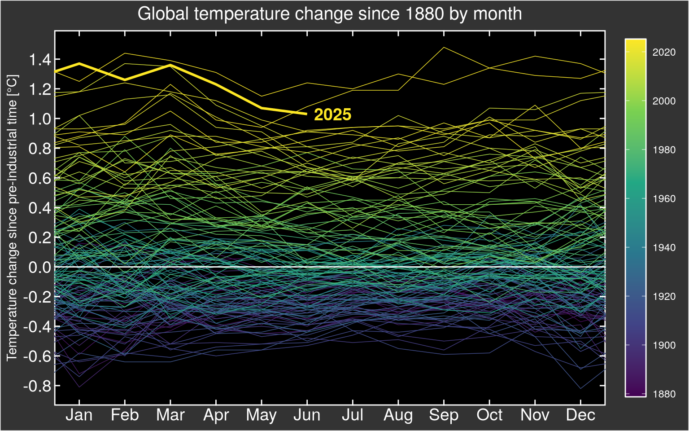

::: {.cell}

```{.r .cell-code}
library(tidyverse)
library(scales)
library(glue)
```
:::


::: {.cell}

```{.r .cell-code}
temps <- read_csv("data/GLB.Ts+dSST.csv", skip = 1, na = "***") %>% 
  select(year = Year, all_of(month.abb)) %>% 
  pivot_longer(-year, names_to = "month", values_to = "t_diff") %>% 
  drop_na()
```

::: {.cell-output .cell-output-stderr}

```
Rows: 146 Columns: 19
── Column specification ────────────────────────────────────────────────────────
Delimiter: ","
dbl (19): Year, Jan, Feb, Mar, Apr, May, Jun, Jul, Aug, Sep, Oct, Nov, Dec, ...

ℹ Use `spec()` to retrieve the full column specification for this data.
ℹ Specify the column types or set `show_col_types = FALSE` to quiet this message.
```


:::
:::


::: {.cell}

```{.r .cell-code}
last_dec <- temps %>% 
  filter(month == "Dec") %>% 
  mutate(year = year + 1,
         month = "last_Dec")

next_jan <- temps %>% 
  filter(month == "Jan") %>% 
  mutate(year = year - 1,
         month = "next_Jan")

t_data <- 
  bind_rows(last_dec, temps, next_jan) %>% 
  mutate(month = factor(month, levels = c("last_Dec", month.abb, "next_Jan")),
         month_number = as.numeric(month) - 1,
         this_year = year == max(temps$year))

annotation <- t_data %>% 
  slice_max(year) %>% 
  slice_max(month_number)
```
:::


::: {.cell}

```{.r .cell-code}
t_data %>% 
  ggplot(aes(x = month_number, y = t_diff, 
             group = year, color = year,
             size = this_year)) +
  geom_line() +
  geom_hline(yintercept = 0, color = "white") +
  geom_text(data = annotation, 
            aes(x = month_number, y = t_diff,
                label = year, color = year),
            hjust = 0, size = 5, nudge_x = 0.15, font = "bold",
            inherit.aes = FALSE) +
  scale_x_continuous(breaks = 1:12,
                     labels = month.abb,
                     sec.axis = dup_axis(name = NULL, labels = NULL)) + # for ticks at top
  scale_y_continuous(breaks = seq(-2, 2, 0.2),
                     sec.axis = dup_axis(name = NULL, labels = NULL)) +
  scale_size_manual(breaks = c(FALSE, TRUE),
                    values = c(0.25, 1),
                    guide = FALSE) +
  scale_color_viridis_c(breaks = seq(1880, 2024, 20),
                        guide = guide_colourbar(frame.colour = "white",
                                                frame.linewidth = 0.5)) +
  coord_cartesian(xlim = c(1,12)) +
  labs(x = NULL,
       y = "Temperature change since pre-industrial time [\u00B0C]",
       title = glue("Global temperature change since {min(temps$year)} by month")) +
  theme(
    plot.background = element_rect(fill = "#333333"),
    panel.background = element_rect(fill = "black",
                                    color = "white",
                                    size = 1),
    panel.grid = element_blank(),
    axis.text = element_text(color = "white", size = 14),
    axis.ticks = element_line(color = "white"),
    axis.ticks.length = unit(-5, "pt"),   # Moves the ticks inside the plot
    axis.title = element_text(color = "white"),
    plot.title = element_text(color = "white", size = 15, hjust = 0.5),
    legend.title = element_blank(),
    legend.background = element_rect(fill = NA),
    legend.text = element_text(color = "white"),
    legend.key.height = unit(60, "pt")
)
```

::: {.cell-output-display}
{width=768}
:::
:::


::: {.cell}

```{.r .cell-code}
ggsave("figures/temp_annual_monthly.png", width = 8, height = 5)
```
:::


