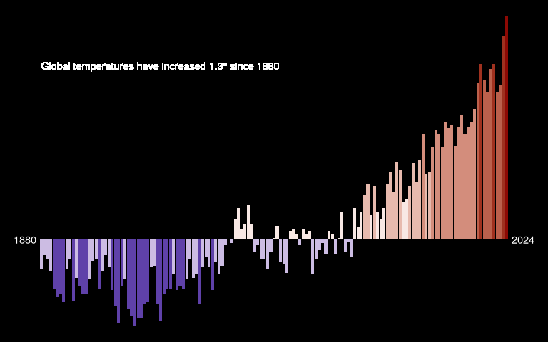

# Styling Bar Plot Climate Index

``` r
library(tidyverse)
library(scales)
library(glue)
```

``` r
temps <- read_csv("data/GLB.Ts+dSST.csv", skip = 1, na = "***") %>% 
  select(year = Year, t_diff = 'J-D') %>% 
  drop_na()
```

    Rows: 146 Columns: 19
    ── Column specification ────────────────────────────────────────────────────────
    Delimiter: ","
    dbl (19): Year, Jan, Feb, Mar, Apr, May, Jun, Jul, Aug, Sep, Oct, Nov, Dec, ...

    ℹ Use `spec()` to retrieve the full column specification for this data.
    ℹ Specify the column types or set `show_col_types = FALSE` to quiet this message.

``` r
annotation <- temps %>% 
  arrange(year) %>% 
  slice(1, n()) %>% 
  mutate(t_diff = 0,
         x = year + c(-5, +5)) # to position at y=0

max_t_diff <- format(round(max(temps$t_diff), 1), nsmall = 1)

temps %>% 
  ggplot(aes(x = year, y = t_diff, fill = t_diff)) +
  geom_col(show.legend = F) +
  geom_text(data = annotation, aes(x = x, label = year), color = "white") +
  geom_text(x = 1880, y = 1, hjust = 0,
            label = glue("Global temperatures have increased {max_t_diff}\u00B0 since {min(temps$year)}"),
            color = "white") +
  #scale_fill_gradient2(low = "darkblue", mid = "white", high = "darkred",
  #                     midpoint = 0, limits = c(-0.5, 1.5)) +

  # scale_fill_gradientn(colors = c("darkblue", "white", "darkred"),
  #                      values = rescale(c(min(temps$t_diff), 0, max(temps$t_diff))),
  #                      limits = c(min(temps$t_diff), max(temps$t_diff))) +
  
  scale_fill_stepsn(colors = c("darkblue", "white", "darkred"),
                       values = rescale(c(min(temps$t_diff), 0, max(temps$t_diff))),
                       limits = c(min(temps$t_diff), max(temps$t_diff)),
                    n.breaks = 9) +
  
  theme_void() +
  theme(
    plot.background = element_rect(fill = "black"),
    legend.text = element_text(color = "white")
  )
```



``` r
ggsave("figures/temp_index_bar.png", width = 8, height = 5)
```
