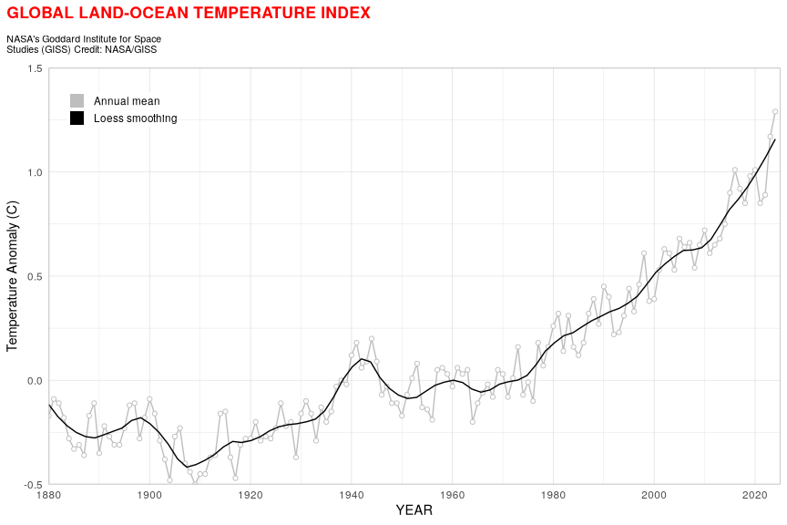

# Styling Line Plot Climate Index

``` r
library(tidyverse)
```

``` r
temps <- read_csv("data/GLB.Ts+dSST.csv", skip = 1, na = "***")
```

    Rows: 146 Columns: 19
    ── Column specification ────────────────────────────────────────────────────────
    Delimiter: ","
    dbl (19): Year, Jan, Feb, Mar, Apr, May, Jun, Jul, Aug, Sep, Oct, Nov, Dec, ...

    ℹ Use `spec()` to retrieve the full column specification for this data.
    ℹ Specify the column types or set `show_col_types = FALSE` to quiet this message.

``` r
temps %>% 
  select(year = Year, t_diff = 'J-D') %>% 
  ggplot(aes(x = year, y = t_diff)) +
  geom_line(aes(color = "1"), size = 0.5, show.legend = F) +
  geom_point(fill = "white", aes(color = "1"), shape = 21, show.legend = T) +
  geom_smooth(se = F, aes(color = "2"), size = 0.5, span = 0.15, show.legend = F) +
  scale_x_continuous(breaks = seq(1880, 2020, 20), expand = c(0,0)) +
  scale_y_continuous(limits = c(-0.5, 1.5), expand = c(0,0)) +
  scale_color_manual(name = NULL, 
                     breaks = c(1, 2),
                     values = c("grey", "black"),
                     labels = c("Annual mean", "Loess smoothing"),
                     guide = guide_legend(override.aes = list(shape = 15,
                                                              size = 5))) +
  labs(
    x = "YEAR", y = "Temperature Anomaly (C)",
    title = "GLOBAL LAND-OCEAN TEMPERATURE INDEX",
    subtitle = "NASA's Goddard Institute for Space\nStudies (GISS) Credit: NASA/GISS"
  ) +
  theme_light() +
  theme(
    axis.ticks = element_blank(),
    plot.title.position = "plot",
    plot.title = element_text(margin = margin(b=10), color = "red", face = "bold"),
    plot.subtitle = element_text(size = 8, margin = margin(b=10)),
    legend.position = c(0.1, 0.9),
    legend.title = element_text(size = 0),
    legend.key.height = unit(10, "pt"),
    legend.margin = margin(0,0,0,0)
  )
```



``` r
ggsave("figures/temp_index_plot.png", width = 9, height = 6)
```

    `geom_smooth()` using method = 'loess' and formula = 'y ~ x'

    Warning: Removed 1 row containing non-finite outside the scale range
    (`stat_smooth()`).

    Warning: Removed 1 row containing missing values or values outside the scale range
    (`geom_line()`).

    Warning: Removed 1 row containing missing values or values outside the scale range
    (`geom_point()`).
