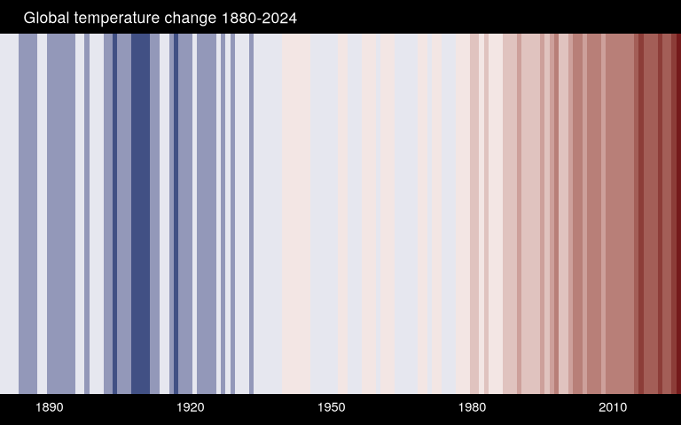

# Styling Bar Plot Climate Index

``` r
library(tidyverse)
library(scales)
library(glue)
```

``` r
temps <- read_csv("data/GLB.Ts+dSST.csv", skip = 1, na = "***") %>% 
  select(year = Year, t_diff = 'J-D') %>% 
  drop_na()
```

    Rows: 146 Columns: 19
    ── Column specification ────────────────────────────────────────────────────────
    Delimiter: ","
    dbl (19): Year, Jan, Feb, Mar, Apr, May, Jun, Jul, Aug, Sep, Oct, Nov, Dec, ...

    ℹ Use `spec()` to retrieve the full column specification for this data.
    ℹ Specify the column types or set `show_col_types = FALSE` to quiet this message.

``` r
ggplot(temps, aes(x = year, y = 1, fill = t_diff)) +
  geom_tile(show.legend = F) +
  scale_fill_stepsn(colors = c("#08306B", "white", "#67000D"),
                    values = rescale(c(min(temps$t_diff), 0, max(temps$t_diff))),
                    n.breaks = 12) +
  coord_cartesian(expand = F) + # go up to edged
  scale_x_continuous(breaks = seq(1890, 2020, 30)) +
  labs(title = glue("Global temperature change {min(temps$year)}-{max(temps$year)}")) +
  theme_void() +
  theme(
    axis.text.x = element_text(color = "white",
                               margin = margin(t = 5, b = 10, unit = "pt")),
    plot.title = element_text(color = "white",
                               margin = margin(t = 10, b = 5, l = 20, unit = "pt")),

    plot.background = element_rect(fill = "black")
  )
```



``` r
ggsave("figures/temp_warming_stripes.png", width = 8, height = 5)
```
